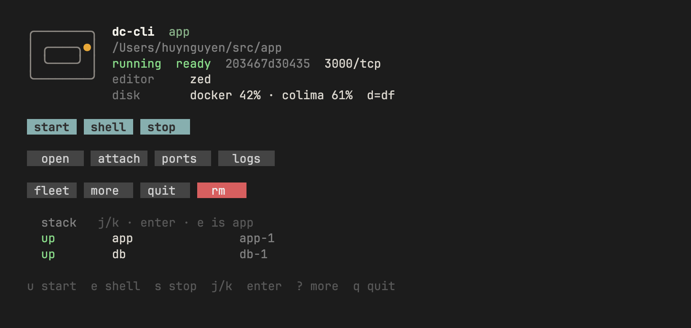

# DC-CLI

Site: [dc.brasth.com](https://dc.brasth.com) · Guides: [dc.brasth.com/guide](https://dc.brasth.com/guide/) · Issues: [dc.brasth.com/issues](https://dc.brasth.com/issues/)

Host-global helpers around official [`@devcontainers/cli`](https://github.com/devcontainers/cli). **No VS Code required. Does not edit** project `.devcontainer/devcontainer.json`.

Upstream only has `up` / `exec`. This repo adds **stop**, **list**, **open**, **port publish**, **doctor**, and a **TUI**.

```
this folder
   │
   ├─ dc-tui          clickable board (default)
   ├─ dc-doctor       read-only diagnose (human or --json)
   ├─ dc-stats        read-only CPU / RAM / net (this folder)
   ├─ dc-net          this folder's declared compose nets
   ├─ dc-up           start the labeled app + publish ports
   ├─ dc-exec         shell in the app
   ├─ dc-exec --service NAME   start (if needed) + shell in another service
   ├─ dc-db           host TablePlus on a declared db port
   ├─ dc-files        yazi/nnn in the box, else Linux yazi copied into /tmp
   ├─ dc-forward      reconcile owned sidecars (Colima-safe)
   └─ dc-down         stop the app (sidecars go too)
```

## Install

```bash
curl -fsSL https://raw.githubusercontent.com/Brasth/dc-cli/main/install.sh | bash -s -- --with-cli
```

Always tracks the **latest GitHub release** (currently **v0.12.0**, prebuilt clickable TUI). The one-liner passes `--with-cli` so `dc-up` can start via the **official standalone** installer — not npm. Safer: clone, then `bash install.sh` (no flags = wrappers only; add `--with-cli` if you need official CLI).

macOS/Linux via Homebrew (same kit, no Go required):

```bash
brew tap Brasth/dc-cli
brew install dc-cli          # already tapped: brew update && brew upgrade dc-cli
```

Each person needs their **own** Docker/Colima. Do not share one engine — fleet, prune, and `--take-ports` see the whole daemon.

| Flag | What you get |
|---|---|
| *(default)* | wrappers generation only — **not** the official CLI |
| `--with-cli` | official **standalone** `@devcontainers/cli` if missing (never npm) |
| `--with-cli-npm` | explicit exact-pin `npm i -g @devcontainers/cli@<qualified>` |
| `--with-skill` | copy the agent skill into homes you already have |
| `--full` | `--with-cli` + `--with-skill` |
| `--ref v0.4.3` / `main` | pin a tag or use HEAD |
| `--no-yazi` | do not prefetch Linux yazi (`DC_SKIP_YAZI=1`) |

Needs: bash 4+, Docker (Colima or Desktop). Official CLI floor is whatever `docs/qualification/devcontainer-cli-floor.md` records (unpublished until a release engineer signs four platforms). Stock standalone `--node-version` pins a **Node major only** (mutable patch) — not a reproducible Node pin. Release/brew installs include the clickable TUI. A source install builds it when Go is on PATH; otherwise you get the bash menu. Open a **new login terminal** after a curl install (or `source ~/.zshrc` / `~/.bashrc`).

## Daily flow

Run these from **your** project folder (the one with `.devcontainer`):

```bash
cd /path/to/your/project
dc-tui                          # or the CLI below
dc-doctor                       # read-only; --json for agents
dc-stats                        # this folder CPU / RAM / net (read-only)
dc-net                          # this folder declared compose nets

dc-up                           # start the labeled app, then publish ports
dc-up --create-nets             # missing external nets: create default bridge, then start
dc-up --take-ports              # clash: stop labeled foreign holders only, retry
dc-exec                         # bash in the app (starts it if it is down)
dc-exec --list                  # labeled app + other services in that compose project
dc-exec --service NAME          # start that compose service if it is down, then bash
dc-exec --service NAME -- cmd   # same, run a command (works without a TTY)
dc-db --list                    # classify stack DBs (passwords redacted)
dc-db                           # open TablePlus on the declared host port
dc-files                        # yazi/nnn in the box, else Linux yazi copied into /tmp
dc-forward                      # reconcile owned sidecars (needs one app or --id)
dc-down                         # stop FULL compose stack (app+db+mitm+…)
dc-down --app                   # labeled app only (+ its sidecars)
dc-down --rm                    # compose down (remove stack containers)

# out of disk (ENOSPC) — report, then safe reclaim
dc-df                           # Docker + Colima disk report
dc-prune                        # dry-run
dc-prune --yes                  # cache + dangling images + nets + orphan sidecars
```

**App vs other services**

| Target | Command | How |
|---|---|---|
| labeled **app** | `dc-exec` | `devcontainer exec` (remoteUser, cwd, features) |
| any other compose **service** | `dc-exec --service NAME` | `docker start` if exited, then `docker exec` |

`NAME` is whatever `docker compose` calls the service (`dc-exec --list`). Click a **stack row** in the TUI for the same path. `e` / **shell** is always the app.

## TUI



```
dc-tui              # this folder (cwd, then git root)
dc-tui ~/src/app
dc-tui --all        # every labeled workspace
```

Primary row: **start** · **shell** · **stop**. Meta row is quieter. **rm** is danger and asks `y/n`. Stack / fleet rows: **up** / **down**, `j`/`k` or click, Enter to open or exec.

Startup draws the **dc-cli** mark (host frame + phosphor pip). Any key skips. `DC_TUI_NO_SPLASH=1` skips it. The compact mark stays in the header.

| Button | Key | Does |
|---|---|---|
| **start** | `u` | `dc-up` + `dc-forward` (needs `.devcontainer`) |
| **shell** | `e` | `dc-exec` — **app** only |
| **stop** | `s` | full stack `dc-down` |
| **rm** | `x` | `dc-down --rm` after `y` |
| **open** | `o` | host editor on the bind-mount |
| **attach** | `a` | VS Code Remote URI; Zed prints Connect Dev Container steps |
| **ports** | `p` | `dc-forward` (Colima sidecar) |
| **url** | `1`–`9` / click | open a published website (`http://127.0.0.1:PORT`) |
| **logs** | `l` | follow docker logs for the **selected stack row** (highlighted; q back). Fleet refuses. |
| **restart** | `R` | `dc-exec --service NAME --restart` on the selected sibling. Labeled app row refuses (`u`/`s`). Fleet refuses. `r` still reloads. |
| **db** | `b` | `dc-db` — host TablePlus (etc.) on a declared db port |
| **files** | `m` | `dc-files` — yazi/nnn in the box, else Linux yazi in /tmp |
| **fleet** | `f` | other workspaces |
| **more** / **quit** | `?` / `q` | legend / exit |
| **disk** | `d` | `dc-df` report (stays in TUI) |
| **top** | `t` | CPU / RAM for this folder (stays in TUI). Fleet refuses. |
| **nets** | `n` | this folder's declared compose nets (stays in TUI). `y` creates missing externals then start. Fleet refuses. |
| **rows** | `j`/`k`, Enter | move cursor; fleet opens a folder, stack execs |

Header shows a compact disk line from `dc-df`, an app load pulse from `dc-stats`, and declared compose nets when present. Reclaim stays CLI-only (`dc-prune --yes`).

After **shell** / **start** / **files**, the board comes back. **logs**, **top**, and **nets** stay on the board (`q` back). **R** restarts the selected stack sibling without leaving. A normal `exit` is not a crash.

**open ≠ attach.** Open = files on the Mac/Linux host. `a` / `dc-open --attach` is the VS Code Remote URI into Linux. Zed attaches itself. Sublime cannot.

**db ≠ url tiles.** `b` / `dc-db` opens TablePlus (or DBeaver / rainfrog) on the host port you already set on the db service. It never invents a port. No compose `ports` / matching `forwardPorts` → refuse. Two databases need `--service`. Bind-mount editor stays `o`; `m` / `dc-files` always runs **inside** the container (image FM, or a Linux yazi copied to `/tmp` — never `apt-get`). `e` / `dc-exec` is a color shell (`ls`, prompt, `hl` for access logs).

## Stats

`dc-stats` is read-only CPU / RAM / net for **this folder's** running boxes. Not the Mac Activity Monitor. Guest is the Colima or Docker Desktop VM (native Linux Docker = the host). Desktop never invents live guest CPU/RAM — cap only, `live n/a`. Disk stays `dc-df`.

```bash
dc-stats              # human table
dc-stats --json       # TUI / agents
```

TUI key `t` opens the live overlay. Fleet refuses — this folder only. Sidecar `dc-forward` socat rows are omitted. Unlimited memory prints `used / —`, never a lonely healthy percent.

## Commands (all of them)

| Command | Purpose |
|---|---|
| `dc-tui [dir]` | this folder |
| `dc-tui --all` | fleet |
| `dc-tui --version` / `dc-up --version` | print kit version |
| `dc-doctor [dir] [--json]` | read-only diagnostics (exit 0 usable / 1 blocker / 2 bad argv) |
| `dc-up [dir]` | project config, then `dc-forward` |
| `dc-up --no-forward` | skip sidecars (`DC_FORWARD=0`) |
| `dc-up --ports` | **REPLACE** project config (not a merge) |
| `dc-up --take-ports` / `--yes` | clash: stop **labeled** foreign stacks/sidecars, retry once. `--yes` also creates missing nets |
| `dc-up --create-nets` | create missing declared external nets (does not take ports) |
| `dc-exec` | app shell |
| `dc-exec --list` | stack table |
| `dc-exec --service NAME` | other compose service (starts if down) |
| `dc-exec --service NAME --restart` | `docker restart` that stack sibling (membership-checked). `--id --restart` is refused. |
| `dc-exec --id NAME` | that container (starts if down) |
| `dc-down` | **full compose stack** (app + db + mitm + … + sidecars) |
| `dc-down --app` | labeled app only (+ sidecars) |
| `dc-down --rm` / `--volumes` | compose down / down -v |
| `dc-down --compose` | alias for default full stack (scripts) |
| `dc-down --all --yes` | every labeled workspace stack |
| `dc-ls [--json] [--all]` | labeled app list |
| `dc-open` / `--attach` | host editor / VS Code attach |
| `dc-db` / `--list` / `--print` | host DB client on a **declared** compose/`forwardPorts` port |
| `dc-files` | yazi/nnn in the box, else Linux yazi copied into `/tmp` |
| `dc-forward` / `3000` / `9001:80` / `--stop` | reconcile owned sidecars (one app or `--id`) |
| `dc-ps` | docker + labels |
| `dc-df` / `--json` / `--volumes` | disk report (read-only) |
| `dc-stats` / `--json` | CPU / RAM / net for this folder (read-only) |
| `dc-net` / `--json` / `--ensure` | this folder's declared compose nets; create missing externals |
| `dc-prune` / `--yes` | safe reclaim (cache, dangling, nets, orphan sidecars) |
| `dc-prune --all --yes` | also unused tagged images |
| `dc-prune --volume NAME --yes` | delete **one** named volume |
| `dc-prune --colima-hint` | grow Colima VM disk guidance |

There is **no** `dc` meta-binary. **Never** `docker system prune -af --volumes` — use `dc-df` / `dc-prune`.

## Doctor

`dc-doctor` is read-only. It never starts, stops, prunes, or edits project files. Human text and `--json` share the same 18 checks.

```bash
dc-doctor                 # this folder
dc-doctor ~/src/app
dc-doctor --json          # agents: one document, schemaVersion 1
```

| Exit | Meaning |
|---|---|
| `0` | usable (warnings allowed — including missing `.devcontainer`) |
| `1` | one or more blockers (no Docker, no `devcontainer`, below-floor CLI when a floor is set, …) |
| `2` | invalid invocation only (unknown flag, not a directory) |

Install-time `install.sh` “Doctor:” lines are still just presence smoke. Day-2 diagnosis is `dc-doctor`. Diagnose **before** `dc-prune --yes` or `--take-ports`.

## Ports (Colima)

`dc-up` starts `.devcontainer/docker-compose.yml`. That file often has **no** `3000:3000`. The app listens **inside**; the Mac has nothing on `:3000`.

`dc-forward` **reconciles** owned `alpine/socat` sidecars **on the Docker network**. Host `socat` → `172.x` does **not** work on Colima. Identity is the **host+container pair** (so `9001:80` stays asymmetric). Requires exactly one labeled app or `--id`. Any requested mapping that cannot be ensured fails the command (and `dc-up` after a successful start).

```bash
dc-forward                 # reconcile compose `app.ports` + forwardPorts
dc-forward 3000
dc-forward 9001:80
dc-forward --status
dc-forward --stop
```

`dc-up` runs this after a successful start (`--no-forward` / `DC_FORWARD=0` skips). `dc-down` removes workspace-owned sidecars.

`dc-up --ports` is **not** “add 3000”. It **replaces** the whole `devcontainer.json`.

## Disk full

When `dc-up` fails with **no space left** / ENOSPC:

```bash
dc-df                    # images / cache / volumes + Colima guest df
dc-prune                 # dry-run
dc-prune --yes           # safe set only
dc-up                    # retry
```

| Flag | Risk |
|---|---|
| `dc-prune --yes` | **Engine-wide** build cache, dangling images, unused nets; **owned-only** orphan `dc-forward` sidecars (target proven absent) |
| `dc-prune --all --yes` | **Engine-wide** unused **tagged** images; parked stacks rebuild on next `dc-up` |
| `dc-prune --volume NAME --yes` | **High / owned-only** — named volume data (DBs). One name only; never bulk; mount inventory must succeed |
| `docker system prune -af --volumes` | **Do not** — not wrapped; destroys named volumes |

If Colima guest `/` is still ~100% after prune, the VM disk cap is full: `dc-prune --colima-hint`. Prune does **not** grow the qemu/VZ image.

## Host port conflict

Two projects can publish the same host port (e.g. both `wordpress-mitm` on `9001`). Compose then fails with **port is already allocated**.

```bash
dc-up
# dc-up: host port conflict
#   ports: 9001
#   holders:
#     d11b00f0880b  other-project-wordpress-mitm-1  compose=other  ...
# Stop the holder(s) above and retry dc-up for this folder? [y/N]
```

| Mode | Behavior |
|---|---|
| TTY (interactive) | lists holder → ask **y/N** → stop foreign holders → retry once |
| `dc-up --create-nets` / `DC_UP_CREATE_NETS=1` | create missing declared external nets (does not take ports) |
| `dc-up --take-ports` / `--yes` / `DC_UP_TAKE_PORTS=1` | same without prompt (agents / CI); only **positively labeled** foreign stacks/sidecars. `--yes` also creates missing nets |
| non-TTY without flag | lists holder + how to re-run; does **not** stop |

Stops **other** labeled workspaces only (same-folder containers are skipped). Unlabeled, ambiguous, or inspect-unknown holders are **report-only** — they are not stopped. Prefer stopping a sibling stack over editing project compose ports.

## Editors

| Editor | Host open | Inside the container |
|---|---|---|
| Zed | yes (`/Applications/Zed.app` is enough) | yes — in Zed: **Project: Open Remote → Connect Dev Container** |
| VS Code | yes | yes — `dc-open --attach` |
| Sublime | yes | **no** |

`--editor` / `$DC_EDITOR` / first of `zed`, `code`, `subl` on PATH **or** as a macOS `.app`.

`dc-open` is always the host folder. `dc-open --attach` is VS Code only. Zed (v0.218+) attaches first-party. Start here so Colima ports exist (Zed does not publish `forwardPorts`):

```bash
dc-up            # compose + dc-forward
dc-open          # host folder
# then in Zed: Project: Open Remote → Connect Dev Container
```

dc-cli owns start / stop / ports / fleet. Zed owns the editor session. No Zed extension.

## Platform

| OS | Status |
|---|---|
| macOS | Supported (Colima or Docker Desktop) |
| Linux | Supported |
| WSL2 | Best-effort (run the installer **inside** WSL) |
| Native Windows | **Not supported** |

Create and stop from the same environment so `devcontainer.local_folder` matches.

## Skill

`--with-skill` copies into existing agent homes only (`~/.pi`, `~/.claude`, `~/.codex`, `~/.gemini`, `~/.cursor`, `~/.opencode`, plus `~/.agents/skills`). Restart the agent after install.

## Maintainer

[Canvilled](https://github.com/Canvilled) (Huy Nguyen). MIT.
