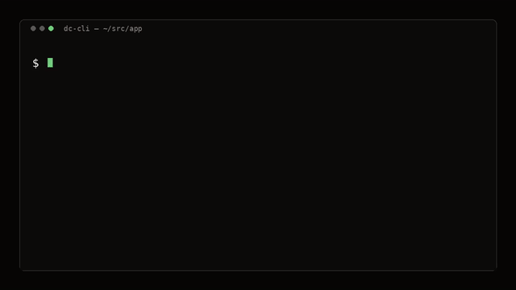

# DC-CLI

**Dev containers from your terminal** — host-global helpers around official [`@devcontainers/cli`](https://github.com/devcontainers/cli). **No VS Code required. Does not edit** project `.devcontainer`.

Site: [dc.brasth.com](https://dc.brasth.com) · Guides: [dc.brasth.com/guide](https://dc.brasth.com/guide/) · Issues: [dc.brasth.com/issues](https://dc.brasth.com/issues/) · Videos: [dc.brasth.com/#demo](https://dc.brasth.com/#demo)



[Full intro video](https://dc.brasth.com/videos/walkthrough-intro.mp4) · [board](https://dc.brasth.com/videos/walkthrough-board.mp4) · [recover](https://dc.brasth.com/videos/walkthrough-recover.mp4)

`.devcontainer` → official CLI. Else a root compose file → Compose. Else `dc up` refuses (use `dc try` for a sandbox).

**Two spellings, same command:** `dc up` = `dc-up`. `dc` with no args is the board.

## See it run

| | |
|---|---|
| **dc up** |  |
| **dc exec** |  |
| **dc doctor** |  |

Full walkthroughs: [intro](https://dc.brasth.com/videos/walkthrough-intro.mp4) · [board](https://dc.brasth.com/videos/walkthrough-board.mp4) · [recover](https://dc.brasth.com/videos/walkthrough-recover.mp4) · [all videos](launch/asset-checklist.md)

## Install

```bash
curl -fsSL https://raw.githubusercontent.com/Brasth/dc-cli/main/install.sh | bash -s -- --with-cli
```

Then `source ~/.zshrc` or `~/.bashrc`. Homebrew: `brew tap Brasth/dc-cli && brew install dc-cli`.

`--with-cli` is the official standalone installer (not npm). Clone with no flags stays wrappers only. Other flags: `--with-cli-npm`, `--with-skill`, `--full`, `--ref`, `--no-yazi`. See the [install guide](https://dc.brasth.com/guide/install/).

## Daily

```bash
cd /path/to/your/project
dc              # board (same as dc-tui)
dc up           # start
dc exec         # shell in the app
dc down         # stop the stack
```

Stuck engine: `dc doctor` then `dc recover --yes`. Disk: `dc df` then `dc prune --yes`. **Never** `docker system prune -af --volumes`.

## Commands

`dc <verb>` and `dc-<verb>` are both installed. `dc --help` lists them. Flags: `dc <verb> --help`.

| Command | Does | Demo |
|---|---|---|
| `dc` / `dc-tui` | board (`--all` = fleet) | [board](https://dc.brasth.com/videos/walkthrough-board.mp4) |
| `dc up` / `dc-up` | start this folder | [daily](https://dc.brasth.com/videos/walkthrough-daily.mp4) |
| `dc exec` / `dc-exec` | app shell (`--service NAME` for siblings) | [clip](https://dc.brasth.com/videos/clip-exec.mp4) |
| `dc down` / `dc-down` | stop the stack (`--app`, `--rm`) | [daily](https://dc.brasth.com/videos/walkthrough-daily.mp4) |
| `dc try` / `dc-try` | sandbox when there is no config | [try](https://dc.brasth.com/videos/walkthrough-try.mp4) |
| `dc doctor` / `dc-doctor` | read-only diagnose | [clip](https://dc.brasth.com/videos/clip-doctor.mp4) |
| `dc recover` / `dc-recover` | one next step (`--yes` applies) | [recover](https://dc.brasth.com/videos/walkthrough-recover.mp4) |
| `dc upgrade` / `dc-upgrade` | check / install latest release | — |
| `dc engine` / `dc-engine` | which engine (`--fix`) | — |
| `dc forward` / `dc-forward` | Colima-safe ports | [ports](https://dc.brasth.com/videos/walkthrough-ports.mp4) |
| `dc db` / `dc-db` | host DB client on a declared port | [power](https://dc.brasth.com/videos/walkthrough-power.mp4) |
| `dc files` / `dc-files` | yazi/nnn in the box | [power](https://dc.brasth.com/videos/walkthrough-power.mp4) |
| `dc open` / `dc-open` | host editor (`--attach` = VS Code) | — |
| `dc df` / `dc-df` | disk report | [disk](https://dc.brasth.com/videos/walkthrough-disk.mp4) |
| `dc stats` / `dc-stats` | CPU / RAM / net | [power](https://dc.brasth.com/videos/walkthrough-power.mp4) |
| `dc net` / `dc-net` | declared compose nets | [ports](https://dc.brasth.com/videos/walkthrough-ports.mp4) |
| `dc prune` / `dc-prune` | safe reclaim (`--yes`) | [disk](https://dc.brasth.com/videos/walkthrough-disk.mp4) |
| `dc ls` / `dc-ls` | labeled apps | [power](https://dc.brasth.com/videos/walkthrough-power.mp4) |
| `dc ps` / `dc-ps` | docker + labels | — |

Task guides: [board](https://dc.brasth.com/guide/tui/) · [kind](https://dc.brasth.com/guide/kind/) · [doctor](https://dc.brasth.com/guide/doctor/) · [ports](https://dc.brasth.com/guide/ports/) · [disk](https://dc.brasth.com/guide/disk/) · [stuck](https://dc.brasth.com/guide/stuck/).

## Platform

macOS and Linux: one live engine (Colima **or** Desktop). WSL2 best-effort. Native Windows not supported.

`--with-skill` copies into existing agent homes (`~/.cursor`, `~/.claude`, `~/.codex`, `~/.pi`, `~/.gemini`, `~/.opencode`, `~/.agents/skills`). Restart the agent after.

[Canvilled](https://github.com/Canvilled) (Huy Nguyen). MIT.
