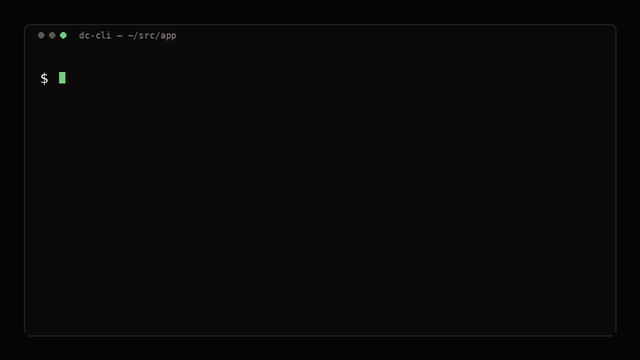

# DC-CLI

**Dev containers from your terminal.**

`dc up` starts this folder. No config? `dc try`. Never edits project `.devcontainer`. Wraps official [`@devcontainers/cli`](https://github.com/devcontainers/cli).



## Install

```bash
curl -fsSL https://raw.githubusercontent.com/Brasth/dc-cli/main/install.sh | bash -s -- --with-cli
```

Then `source ~/.zshrc` or `source ~/.bashrc`. Or Homebrew: `brew tap Brasth/dc-cli && brew install dc-cli`.

`--with-cli` installs the official standalone CLI. Flags: `--with-cli-npm`, `--with-skill`, `--full`, `--ref TAG`, `--no-yazi`. See [install guide](https://dc.brasth.com/guide/install/).

## Daily

```bash
cd /path/to/your/project
dc              # board (same as dc-tui)
dc up           # start this folder
dc try          # sandbox when there is no config
dc exec         # shell in the app
dc down         # stop the stack
```

On the board: `w` recent folders (favorites first; reopening a stopped workspace does not start it), `c` project actions, `v` activity timeline (current session, in memory only), `f` fleet (other workspaces). Troubleshoot: `dc doctor` → `dc recover --yes`. Disk: `dc df` → `dc prune --yes`. **Never** `docker system prune -af --volumes`.

## Commands

`dc <verb>` and hyphenated `dc-<verb>` both work. Run `dc --help` for the full list. Guides: [install](https://dc.brasth.com/guide/install/) · [board](https://dc.brasth.com/guide/tui/) · [try](https://dc.brasth.com/guide/try/) · [doctor](https://dc.brasth.com/guide/doctor/) · [ports](https://dc.brasth.com/guide/ports/) · [disk](https://dc.brasth.com/guide/disk/).

## Project actions

Per-folder commands for the board (`c`) and `dc actions`. Shared `.dc/actions.json` stays **off** until you review and trust its exact bytes. Your personal file lives in `~/.config/dc-cli/actions/`. Runs via `dc exec --no-start` — **never starts containers**. **Actions run inside your containers and can modify data.**

```json
{"schemaVersion": 1, "actions": [{"id": "test", "label": "Run tests", "argv": ["go", "test", "./..."]}]}
```

Trust is tied to the folder and the file's exact bytes; any edit turns them off again. Use `dc actions list`, `dc actions trust` (review then `y/N`), `dc actions run test`. `dc actions` needs the compiled binary: releases, Homebrew, or a source install with Go. A shell-only install reports that the compiled binary is required and shows `--help` only.

## Platform

macOS and Linux: one live engine (Colima or Docker Desktop). WSL2 best-effort. Native Windows not supported.

[Canvilled](https://github.com/Canvilled) (Huy Nguyen). MIT. · Guides: [dc.brasth.com/guide](https://dc.brasth.com/guide/)
