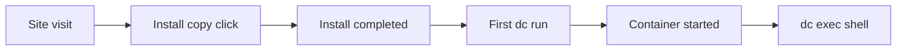

# Funnel tracking — 2-week iteration loop

Date: 2026-08-28

## North-star metric

**Activation:** user reaches `dc exec` (shell in the app container).

Do not optimize for GitHub stars alone — they lag activation and mislead early CLI tools.

## Funnel stages



| Stage | Signal | Source |
|-------|--------|--------|
| Awareness | Unique visitors | Plausible on dc.brasth.com |
| Intent | Install Copy events | Plausible custom event |
| Try-before-install | Play Demo events | Plausible — `/play/` clicks |
| Install | Release download trend | GitHub Releases API |
| Activation | Got a shell? | GitHub feedback issues, launch replies, user DMs |
| Blocker | Where stuck? | [feedback.yml](../.github/ISSUE_TEMPLATE/feedback.yml) dropdown |

## Week 1 — collect baseline

Daily (5 min):

1. Plausible dashboard — visitors, Install Copy, Play Demo
2. GitHub — new issues with `first-run` label
3. Launch thread replies — count yes/no on "got a shell?"

Record in a spreadsheet or private doc:

| Date | UV | Install copies | Play demo | Feedback issues | Shell yes | Shell no |
|------|-----|----------------|-----------|-------------------|-----------|----------|

## Week 2 — fix top drop-off only

Rules:

- **No new CLI verbs** during this window
- Fix **one** drop-off point per iteration
- Re-run affected path manually before shipping

Decision tree:

| Top drop-off | Fix (examples) |
|--------------|----------------|
| Install copy low vs UV | Hero CTA prominence, sticky bar |
| Play demo high, install low | `/play/` → install CTA on demo footer |
| "command not found" | Install page `source` emphasis |
| Docker not ready | `dc recover` copy, engine self-serve v1 |
| No config confusion | TUI / site demo (already improved) |
| dc up fails | TUI error display, recover apply |

## GitHub release downloads (optional CLI)

```bash
# Trend check — no user telemetry required
curl -s https://api.github.com/repos/Brasth/dc-cli/releases/latest | jq '.assets[].download_count'
```

## Qualitative synthesis (end of week 2)

Answer in one paragraph:

1. What % of respondents got a shell?
2. What was the #1 blocker phrase (exact user words)?
3. Did `/play/` → install convert better than homepage-only?

## Next action

Ship **one** fix for the #1 blocker. Re-measure for another 2 weeks. Repeat until activation feedback is mostly "yes."

Launch checklist: [launch/execution.md](../launch/execution.md)
