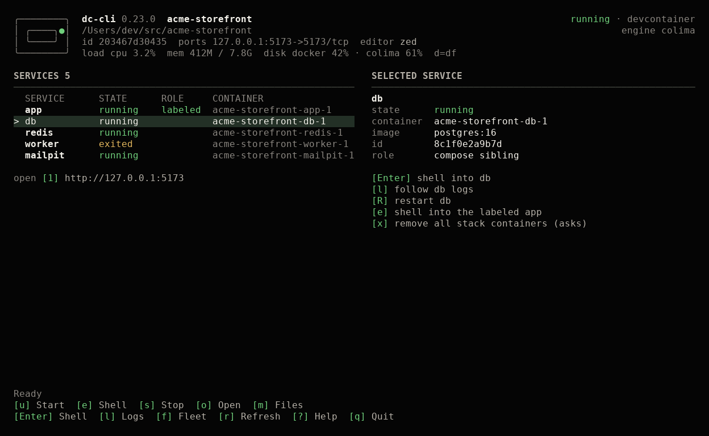

# Phosphor Console

The Go `dc-tui` uses the supplied Phosphor Console design: a compact host/guest mark, warm off-white text, a green accent, a services table, and shortcuts pinned to the bottom. The shell fallback menu is unchanged.



## Responsive layout

| Terminal | Layout |
| --- | --- |
| At least 110 columns and 28 rows | Services beside selected-service details; help replaces the details pane. |
| 80–109 columns | Services, container and image columns, compact selection details below. |
| 60–79 columns | Service, state and role; three primary actions. |
| Below 60 columns or 16 rows | One-line workspace header, service list, target hint and minimal shortcuts. |

The footer reserves its space before the list is rendered. Long lists scroll to keep the selection visible. Paths and names are measured in terminal cells, stripped of terminal controls, and truncated to fit. ANSI-256, ANSI-16 and monochrome terminals retain textual states and selection markers. The terminal controls the background and font.

[All five responsive previews](assets/tui/responsive.png)

## Navigation and targeting

- `j`/`k` or arrows select a row. `PgUp`/`PgDn` move a page; `g`/`G` move to the first/last row. Mouse wheel moves the selection.
- `>` marks selection; `·` marks mouse hover. Hover does not change selection or the detail pane. Clicking a service selects it and opens its shell, as before.
- `Enter` targets the selected service. `e` always targets the labeled app. `l` follows the selected service's logs. `R` retains the sibling-only restart restriction.
- `?` opens help; `PgUp`/`PgDn` scroll it; `Esc` closes it. On wide terminals, the services remain beside help. In the minimal layout, help occupies the content area.
- `w`, `c`, `v`, `f`, `t`, `n`, `d` and the remaining command shortcuts retain their existing meanings. Hidden footer actions remain available by key and in help.
- Multiline command output opens a scrollable output view. `j`/`k`, `PgUp`/`PgDn`, and `g`/`G` scroll; `q`/`Esc` returns to the board.

Clickable shortcut rectangles use the same geometry as the displayed footer and website links. Service click targets account for the scroll position and exclude the detail pane.

## State and feedback

`checking…` means discovery is incomplete. `stopped` requires successful empty discovery. `unknown` means discovery failed. `refreshing…` retains the previous snapshot.

The feedback row stays present. Normal returns use neutral text, unavailable actions use `!` with a reason, failures use `✗`, and known command success uses `✓`. Disk warnings include `CRITICAL` and `[P]`; release notices retain `U`.

Confirmation names the operation, command and workspace target where applicable. Removal, sandbox creation, upgrade and prune retain their existing `y` confirmation paths. Clicking a confirmation does not execute it.

Fleet, logs, top, networks, recovery, recent workspaces, project actions, activity and trust review use the same colors, headings, separators and shortcut language. Logs expand tabs at eight-cell stops. Ended logs and stale top measurements are explicitly marked.

Shared-action review still shows the complete escaped command arguments, including overridden entries. Trust still requires the end of the review to have been shown and remains tied to the file's exact bytes. Terminals too small to show review content cannot enable it. Project actions continue to use `--no-start`.

## Implementation and previews

- `cmd/dc-tui/theme.go`: semantic colors, text sanitation, cell sizing and common screen framing.
- `cmd/dc-tui/console_view.go`: responsive board and hitbox geometry.
- `cmd/dc-tui/screen_view.go`: common headers, recovery and output views.
- `cmd/dc-tui/console_view_test.go`: layout, interaction, state, Unicode, monochrome and viewport regression coverage.

Previews use illustrative data exported by the actual Go view functions. They do not demonstrate a live Docker session.

```bash
DC_TUI_PREVIEW_DIR=/tmp/dc-previews go test ./cmd/dc-tui -run TestConsolePreviewFixtures -count=1
python3 scripts/render-tui-previews.py /tmp/dc-previews/fixtures.json
```

The preview script requires Pillow, writes `docs/assets/tui/`, and updates the board/top images used by the site. It does not execute container commands.

Build locally with the repository's Go toolchain:

```bash
go build -o /tmp/dc-tui ./cmd/dc-tui
PATH="$PWD/bin:$PATH" /tmp/dc-tui "$PWD"
```

The redesign is in the compiled Go TUI; rebuilding is necessary to see it in an installed release.
